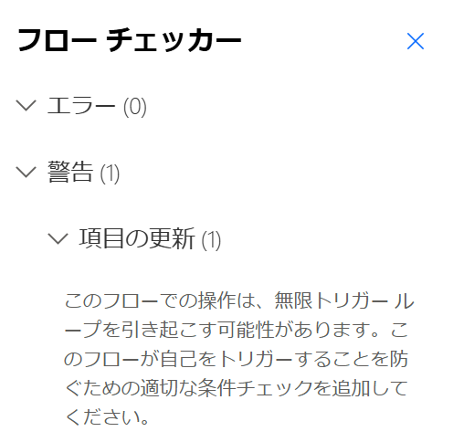
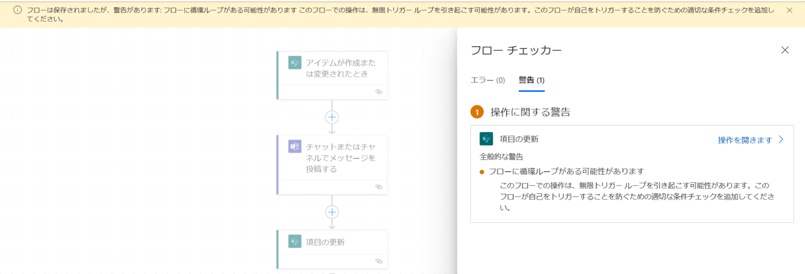
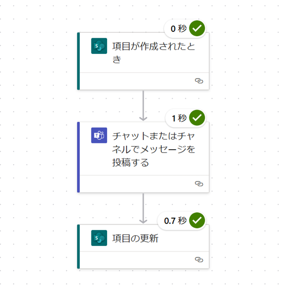
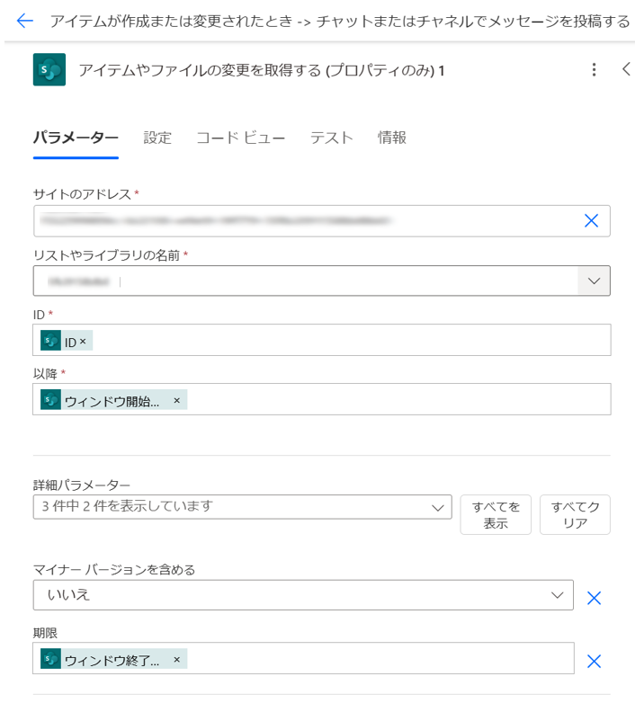

# Power Automate のフローで無限トリガーループが起きる際の対処法
こんにちは。Power Platform サポートチームの トテ です。
今回は、 Power Automate のフローで無限トリガーループが起きる際の対処法についてご紹介します。

<!-- more -->

## 1 . 無限トリガーループ事象
Power Automate フローを実行した際、ないしはフローチェッカー上に、「このフローでの操作は、無限トリガーループを引き起こす可能性があります」という警告メッセージが表示されてしまうケースがあります。

 

 
*無限トリガーループとは、ワークフローまたは自動化プロセスが無限にトリガーされる状態を指します。一度の動きを想定しているつもりが、フローをオフにしない限り、同じ動作が繰り返し起きてしまう状態です。

  

## 2. Power Automate 上で見られる実例
以下のフローを作成していると仮定します。

① SharePoint コネクタの **「アイテムが作成または変更されたとき」のトリガーを使用** して SharePoint リストに登録 
② Teams のチャネルに①の内容を投稿 
③ ②のメッセージリンクを①のリンク列に追加

上記において、無限トリガーループの警告メッセージが表示される場合には、フロー内での更新に対してもフローが起動してしまうことで、再度 SharePoint のアイテムが更新される状況になっていることが考えられます。  

### 事象の原因
無限トリガーループの原因は、トリガーで指定しているリスト（テーブル）と同一のリスト（テーブル）を更新する処理が入っているためです。

 
今回の場合、
 例として挙げているフローは、フロー①の段階において、SharePoint 上で作成または更新がなされた際にフローが起動する状態を指定しています。すると、フローが起動した際に無条件で SharePoint のアイテムを更新するという状態になってしまうため、無限ループの動作が発生してしまいます。

  

## 3. 対策
無限トリガーループを回避するためには、トリガーで指定しているリストと同一のリストを更新するアクションを避けるか、適切な条件を設定して無限ループを防止する必要があります。  
### アイテム作成時のみのトリガーで要件を満たせる場合（ SharePoint リストアイテムの更新ではフローをトリガーする必要がない場合）

下記の画像のように、①の段階で、**「アイテムが作成または変更されたとき」** のトリガーではなく、**「項目が作成されたとき」** という SharePoint のトリガーをご使用いただくと、当該の警告事象は起こらずにご利用いただけます。

  

### SharePoint リストアイテムの作成、更新どちらでもトリガーを必要とする場合

対策の手順は主に2つです。

**①〈 SharePoint コネクタのアクション : 「アイテムやファイルの変更を取得する(プロパティのみ)」の追加〉**

既存のフローに SharePoint コネクタ の「アイテムやファイルの変更を取得する(プロパティのみ)」のアクションを追加します。 

パラメーターの内容における設定例
- サイトのアドレスおよびリストやライブラリの名前 : 「アイテムが作成または変更されたとき」のアクション同じ SharePoint サイト・リスト を指定します。
- ID : 動的コンテンツにて、 「アイテムが作成または変更されたとき」の ID を指定します。
- 以降 : 動的コンテンツにて、 「アイテムが作成または変更されたとき」の「ウィンドウ開始のトークンのトリガー」を指定します。
- 期限 : 動的コンテンツにて、「アイテムが作成または変更されたとき」の「ウィンドウ終了のトークンのトリガー」を指定します。
  
  

**②〈条件分岐の追加〉**　 
次に条件分岐を追加します。
リンクが更新された場合には Teams に投稿をせず、新規作成またはそれ以外の列が更新された場合には Teams に投稿をする、という条件を作成します。

パラメーターの内容における設定例
- 左辺： 「アイテムやファイルの変更を取得する(プロパティのみ)」の動的コンテンツより、SharePoint のリンクを格納している列に該当するものを取得し設定します。
- 中央：is equal to (に等しい)
- 右辺：false

上記の条件の場合、Teams に投稿以降のアクションを条件分岐の True (はい)側に含めるようにご設定ください。

また、トリガー条件を追加することで、無限トリガーループを回避することもできます。例えば、今回の場合、Link列が設定されていない場合にのみフローを起動するような条件を追加することがこれにあてはまります。トリガー条件の設定の仕方詳細は次のブログを参考にしてください。[トリガー条件の設定の仕方詳細](https://jpdynamicscrm.github.io/blog/powerautomate/cloudflow-trigger-condition/)

 

参考URL
https://learn.microsoft.com/en-us/connectors/sharepointonline/#get-changes-for-an-item-or-a-file-(properties-only)

 

> [!NOTE]
なお、フロー編集画面での警告は本変更実施後も表示される可能性はありますが、対策の実行により、無限ループは発生せず、フローの動作は問題ないことが確認できました。

  

## 最後に
本記事がご利用の皆様のお役に立てましたら幸いです。ご不明な点などがございましたら、弊社サポート一同にてお待ち申し上げておりますので、ぜひお気軽にお問合せください。